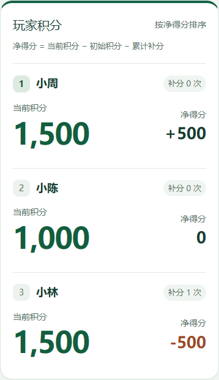

# 一起记分 · Friends Score

朋友间的共享积分板：一人负责记分，其他人用自己的手机查看积分与排名。适合线下活动，积分不涉及支付或兑换。

**这是可自行部署的源码，不提供共享的公共后端。每位部署者使用自己的 Netlify 项目、存储和额度。**

[](https://app.netlify.com/start/deploy?repository=https://github.com/Shuo-Jiang/friends-score)



截图使用测试昵称和测试积分。

## 能做什么

- 创建 2–12 人的活动，自定每人初始积分（1–1,000,000 的整数）。
- 大号显示当前积分，按净得分排名。
- 由持有管理链接的人记录加减分；每次变化总和必须为零，余额不能为负。
- 归零后手动补回初始值，单独累计补分，不增加净得分。
- 撤销最近可撤销的记分或补分，添加参与者，结束活动后只读。
- 观看链接与管理链接分开；支持保存管理链接后换设备继续管理。
- 页面可见时定期同步，活动中约 5 秒、已结束约 30 秒，隐藏页面暂停轮询。
- 保留最近 200 条操作记录。

净得分 = 当前积分 − 初始积分 − 累计补分。

## 部署到自己的账号

1. 准备自己的 GitHub 和 Netlify 账号，选择适合自己的套餐。
2. 点击上面的 **Deploy to Netlify**，按平台提示创建自己的仓库副本和站点。
3. 检查构建设置：命令 `npm run build`，发布目录 `dist`，函数目录 `netlify/functions`。项目根目录的 `netlify.toml` 已包含这些配置。
4. 部署后访问分配给你的网址。若打开网址要求访客登录 Netlify，在项目的访问保护设置中核对是否适合对朋友公开访问。
5. 创建测试活动，用另一个浏览器打开观看链接，确认能同步且不能改分。

也可以先 Fork 仓库，再在 Netlify 选择 **Add new project → Import an existing project** 导入自己的仓库。

无需配置本项目作者的账号、站点 ID 或密钥。Netlify Functions 在当前项目中访问该项目的 Blobs 存储；前端只请求当前网站的 `/api/*`。仅上传静态 `dist` 文件夹不能完整部署同步后端。GitHub Pages 不能直接运行本项目的 Netlify 后端函数。

免费套餐有额度限制，访问、计算、流量和发布可能消耗额度。查看你自己账号的实际套餐及 [官方价格](https://www.netlify.com/pricing/)，本项目不承诺不限量使用。开放自己的网站给公众访问会使用自己的额度。

## 在本地运行

需要 Node.js **22.13 或以上版本**及 npm。

```sh
npm ci
npm test
npm run build
npm start
```

打开 `http://localhost:8888`。本地模式模拟网页、函数和存储，不需要登录 Netlify；本地数据保存在被 Git 忽略的 `.netlify/` 中。

`npm run dev` 只启动前端开发服务器；完整计分与同步测试请使用上面的本地模拟流程。修改源码后需要重新构建并按需重启本地预览。

若 8888 已被其他程序占用，请先停止那个预览，或调整本地端口及测试地址。

## 测试

```sh
npm test
npm run build
```

浏览器测试（需要另一个终端保持 `npm start` 运行）：

```sh
npx playwright install chromium
npm run test:e2e
```

如果系统已有 Edge，可以用 `BROWSER_CHANNEL=msedge` 环境变量选择它。PowerShell 示例：

```powershell
$env:BROWSER_CHANNEL = 'msedge'
npm run test:e2e
```

默认测试地址为 `http://localhost:8888`，可用 `TEST_BASE_URL` 指定。浏览器测试会创建测试活动；对非本机地址默认拒绝执行。仅在你自己的测试部署上使用时，才显式设置 `ALLOW_REMOTE_TESTS=1`。不要对别人的服务运行写入测试。

测试涵盖权限、并发冲突、重复请求、补分净得分、撤销、结束只读、双浏览器同步、管理恢复、断线恢复和小屏幕布局。截图保存到 `outputs/`，不提交到 Git。

## 项目结构

| 文件 | 作用 |
| --- | --- |
| `src/App.tsx` | 页面、管理链接、操作和轮询 |
| `src/style.css` | 大号积分与响应式样式 |
| `src/lib/scoring.ts` | 计分规则和状态变化 |
| `server/rooms.ts` | API、权限、输入校验与并发控制 |
| `netlify/functions/rooms.ts` | 当前项目的 Netlify Blobs 存储适配 |
| `public/check.html` | 创建测试活动并检查同步的页面 |
| `tests/rooms.test.ts` | 后端回归测试 |
| `scripts/qa.cjs` | 完整 API 与浏览器测试 |
| `scripts/prepare-local.mjs` | 锁定版本的本地模拟器兼容处理 |

技术栈：React、TypeScript、Vite、Tailwind CSS、Netlify Functions、Netlify Blobs。

## 权限与数据边界

- 不使用账号登录，持有管理链接就有对应活动的管理能力；请自行保存，勿当成观看链接分享。
- 观看链接不核验现实身份，获得链接的人可以查看活动。
- 管理密钥保存在当前浏览器；服务端保存其 SHA-256 摘要。丢失全部密钥副本后，没有账号式的找回流程。
- 没有内置自动备份、数据导出、管理密钥轮换或活动删除界面。数据随部署者的项目存储保存，应自行制定备份和清理方式。
- `/api/health` 只检查函数响应，不执行存储读写；完整验证应创建测试活动。
- 服务端使用强一致读取、ETag 条件写入及请求编号，处理并发冲突与重复提交。已处理请求编号保留最近 200 个。
- 这是面向小规模朋友活动的工具，不是带完整用户、成员邀请和审计体系的公共服务。

## 本地模拟器兼容处理

锁定的 `@netlify/blobs 11.1.0` 本地模拟器未返回读取 ETag，且条件写入检查和写入之间可能竞争；`netlify-cli 27.8.0` 的本地代理还可能把 JSON 403 当作静态页面重试。

`npm start` 会运行 `scripts/prepare-local.mjs`，仅修改安装在本机 `node_modules` 中的对应实现。脚本检查原始片段是否匹配，支持重复运行；不匹配时停止并要求复核。线上函数不使用这些补丁。升级相关依赖时必须复核兼容处理及并发测试。

## 参与和许可

欢迎通过 Issue 报告问题，通过 Pull Request 提交改进。见 [贡献说明](CONTRIBUTING.md) 与 [安全说明](SECURITY.md)。

项目由维护者在 AI 编程助手协助下完成，发布代码及测试供复查，不以自动生成替代验证。

采用 [MIT License](LICENSE)。复制到项目中的第三方 UI 代码保留其原始许可，见 [第三方声明](THIRD_PARTY_NOTICES.md)。

新手可阅读 [开源与部署入门](docs/open-source-guide.md)。
